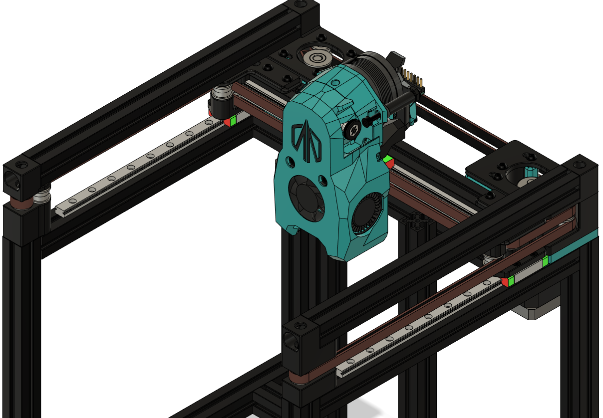

# Pandora

After weeks of planning, trial and error, CAD work and scrapping dozens of attempts, I present Pandora, a gantry mod for the Voron V0 that allows 144mm of X travel and 127mm of Y travel within the stock frame.

The Goal
---
I've been wanting to be able to incorporate a nozzle brush, purge bucket, sexbolt mod, etc., but there just wasn't enough travel with the stock gantry. The added travel outside the bounds of the bed should allow for a plethora of additional mods as well as a higher density of mods within the stock frame.

Something's Missing
---
The astute among you may have noticed that there are no tensioners or tensioner knobs for the motor mounts. That's because this design uses the stock designs for those items. Please hop over to the (Voron-0)[https://github.com/VoronDesign/Voron-0] repo to pick these up if you don't already have them.

It wasn't all fun and games
---
This project was almost shelved several times in the short while that I've been working on it. There's a lot of little things that had to line up just right in order for something like this to be possible. I'm still not sure if it was a miracle, my ingenuity or complete and utter dumb luck that the stars aligned to make this happen.

What's the Catch?
---
In order to use this mod you will need a new linear rail for X motion. In order to achieve 144mm of X travel, the stock 150mm rail won't cut it. The bearing block would fall off the rail before you hit full travel. On top of that, you'll also need some 3x14mm pins and a couple of extra F623 bearings. Aside from new parts you'll also have to account for the gantry being raised by ~8mm over stock. This means that the linear rails for Z motion will need to be raised and there's a possibility that things will get cramped under the tophat.

The biggest hurdle for some is going to be that this setup currently requires sensorless homing as there isn't really a good place to put X or Y endstops.

BOM
---
| QTY | Part | Comments |
| --- | --- | --- |
| 1 | MGN7-H Linear Guide Rail 180-200mm |
| or | MGN9-C Linear Guide Rail 180-200mm |
| or | MGN9-H Linear Guide Rail 180-200mm |
| 2 | 3x14mm Dowel Pins |
| 4 | F623 Bearings (V0 BOM Bearings) |
| | The rest of the parts should be BOM leftovers |
